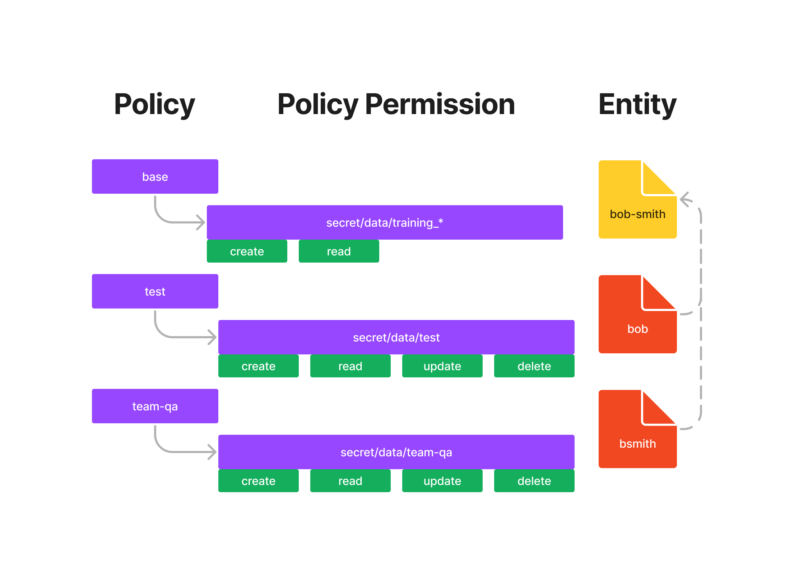

# Vault Entity Alias Testing
Create an entity representing Bob, and associate aliases representing each of his accounts as the entity member. You can set additional policies and metadata on the entity level so that both accounts can inherit. This example was created using the [Identity: entities and groups](https://developer.hashicorp.com/vault/tutorials/auth-methods/identity) guide.

## Does an entity alias always inherit a policy

Each user may have multiple accounts with various identity providers, and Vault supports many of those providers to authenticate with Vault. Vault Identity can tie authentications from various auth methods to a single representation. This representation of a consolidated identity is called an Entity, and their corresponding accounts with authentication providers can be mapped as Aliases. In essence, each entity is made up of zero or more aliases. An entity cannot have more than one alias for a particular authentication backend.

For example, a user with accounts in both GitHub and LDAP can be mapped to a single entity in Vault with two aliases, one of type GitHub and one of type LDAP.


When a client authenticates via any credential backend (except the Token backend), Vault creates a new entity. It attaches a new alias to it if a corresponding entity does not already exist. The entity identifier will be tied to the authenticated token. When such tokens are used, their entity identifiers are audit logged, marking a trail of actions performed by specific users.

Entities in Vault **do not** automatically pull identity information from anywhere. It needs to be explicitly managed by operators. This way, it is flexible in terms of administratively controlling the number of entities to be synced against Vault. In some sense, Vault will serve as a *cache* of identities and not as a *source* of identities.

Vault policies can be assigned to entities which will grant *additional* permissions to the token on top of the existing policies on the token. If the token presented on the API request contains an identifier for the entity and if that entity has a set of policies on it, then the token will be capable of performing actions allowed by the policies on the entity as well.


This is a paradigm shift in terms of *when* the policies of the token get evaluated. Before identity, the policy names on the token were immutable (not the contents of those policies though). But with entity policies, along with the immutable set of policy names on the token, the evaluation of policies applicable to the token through its identity will happen at request time. This also adds enormous flexibility to control the behavior of already issued tokens.

It is important to note that the policies on the entity are only a means to grant *additional* capabilities and not a replacement for the policies on the token. To know the full set of capabilities of the token with an associated entity identifier, the policies on the token should be taken into account.

Below is an example of the policy, permission, and entities created in the [Identity: entities and groups](https://developer.hashicorp.com/vault/tutorials/auth-methods/identity) guide:



- In the above example, there are 3 policies: `base`, `test`, and `team-qa`.
- The user `bob` is assigned the `test` policy, which allows access to `secret/data/test`.
- The user `bsmith` is assigned the `team-qa` policy, which allows access to `secret/data/team-qa`.
- An entity called `bob-smith` is created with `bob` and `bsmith` as aliases.
- When logging in as `bob`, the user can access `secret/data/test` according to the assigned policy. The user can also access `secret/data/training_*` as it inherits the parent's policies. However, `bob` is not able to access `secret/data/team-qa`.

```
bob: secret/data/training_test:
create, read

bob: secret/data/test:
create, delete, read, update

bob: secret/data/team-qa:
deny

-----------------------------

bsmith: secret/data/training_test:
create, read

bsmith: secret/data/test:
deny

bsmith: secret/data/team-qa:
create, delete, read, update
```

## Testing
You can test this by first logging into vault:
```bash
export VAULT_ADDR='http://127.0.0.1:8200'
vault login
```
then running the provided script `run.sh`:
```bash
./run.sh
```

## Manual Insructions
1. Create `base` policy.
    
    ```bash
    $ vault policy write base -<<EOFpath "secret/data/training_*" {   capabilities = ["create", "read"]}EOF
    ```
    
2. Create `test` policy.
    
    ```bash
    $ vault policy write test -<<EOFpath "secret/data/test" {   capabilities = [ "create", "read", "update", "delete" ]}EOF
    ```

3. Create `team-qa` policy.
    
    ```bash
    $ vault policy write team-qa -<<EOFpath "secret/data/team-qa" {   capabilities = [ "create", "read", "update", "delete" ]}EOF
    ```

4. List all policies to verify that `base`, `test`, and `team-qa` policies exist.
    
    ```bash
    $ vault policy listbase
    default
    team-qa
    test
    root
    ```

    Note: If you are using HCP Vault, you will also see the `hcp-root` policy.

5. Enable the `userpass` auth method at `userpass-test`.
    
    ```bash
    $ vault auth enable -path="userpass-test" userpass
    ```

6. Create a new user named `bob` in `userpass-test` where the password is `training` and `test` policy is attached.
    
    ```bash
    $ vault write auth/userpass-test/users/bob password="training" policies="test"
    ```

7. Enable the `userpass` auth method at another path, `userpass-qa`.
    
    ```bash
    $ vault auth enable -path="userpass-qa" userpass
    ```

8. Create a new user named `bsmith` in `userpass-qa` where the password is `training` and `team-qa` policy is attached.
    
    ```bash
    $ vault write auth/userpass-qa/users/bsmith password="training" policies="team-qa"
    ```

9. Execute the following command to discover the mount accessor for the userpass auth method.
    
    ```bash
    $ vault auth list -detailed
    Path              Plugin      Accessor
    ----              ----        --------
    token/            token       auth_token_c5943123
    userpass-qa/      userpass    auth_userpass_8c7b8e0f
    userpass-test/    userpass    auth_userpass_264d4705

    Each userpass auth method has a unique Accessor value to identify it.

10. Run the following command to store the `userpass-test` auth accessor value in a file named `accessor_test.txt`.
    
    ```bash
    $ vault auth list -format=json | jq -r '.["userpass-test/"].accessor' > accessor_test.txt
    ```

    The resulting file contains the accessor value (auth_userpass_XXXXX).

11. Similarly, run the following command to store the `userpass-qa` auth accessor value in a file named `accessor_qa.txt`.
    
    ```bash
    $ vault auth list -format=json | jq -r '.["userpass-qa/"].accessor' > accessor_qa.txt
    ```

12. Create an entity for `bob-smith`, and store the returned entity ID in a file named, `entity_id.txt`.
    
    ```bash
    $ vault write -format=json identity/entity name="bob-smith" policies="base" \     metadata=organization="ACME Inc." \     metadata=team="QA" \     | jq -r ".data.id" > entity_id.txt
    ```

13. Now, add the user `bob` to the `bob-smith` entity by creating an entity alias. Set a custom metadata on the `bob` entity alias named, "account," and set its value to be "Tester Account".
    
    ```bash
    $ vault write identity/entity-alias name="bob" \     canonical_id=$(cat entity_id.txt) \     mount_accessor=$(cat accessor_test.txt) \     custom_metadata=account="Tester Account"
    ```

    Note: To set custom metadata on the entity alias, you must run Vault 1.9 or later. If you are running Vault version earlier than v1.9, run the command without custom_metadata=account="Tester Account".

    Example output:
    
    Key             Value
    ---             -----
    canonical_id    24204b50-22a6-61f5-bd4b-803f1a4e4726
    id              ae2cdd0f-9807-7336-2265-5575c71837e7

    Optional - view entity alias

14. Repeat the step to add user `bsmith` to the `bob-smith` entity. Set a custom metadata on the `bob` entity alias named, "account," and set its value to be "QA Eng Account".
    
    ```bash
    $ vault write identity/entity-alias name="bsmith" \     canonical_id=$(cat entity_id.txt) \     mount_accessor=$(cat accessor_qa.txt) \     custom_metadata=account="QA Eng Account"
    ```

    Example output:
    
    Key             Value
    ---             -----
    canonical_id    24204b50-22a6-61f5-bd4b-803f1a4e4726
    id              6066f6af-bb1c-5310-58a1-fd9c8f151573

15. Review the entity details.
    
    ```bash
    $ vault read -format=json identity/entity/id/$(cat entity_id.txt) | jq -r ".data"
    ```